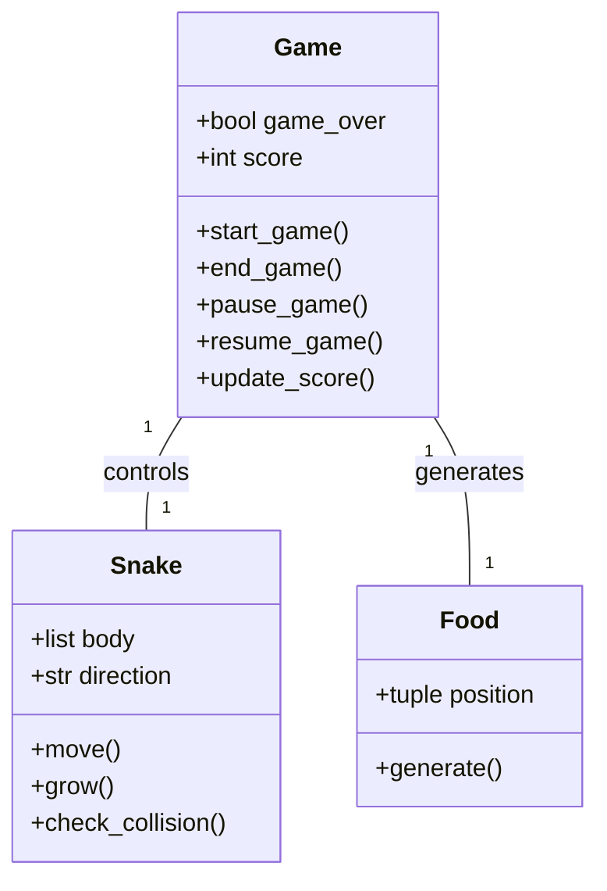
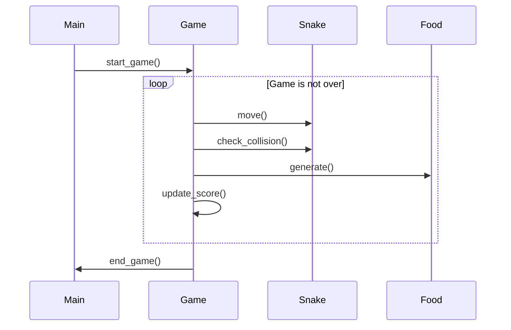

## Implementation approach
We will use the Pygame library, an open-source module for Python, to create the snake game. Pygame provides functionalities for game development such as handling events, rendering graphics, and managing game states. The game will be designed as a single-player game where the player controls a snake to eat food that randomly appears on the screen. The snake grows longer each time it eats food. The game ends when the snake hits the screen border or its own body.

## Python package name
```python
"snake_game_pygame"
```

## File list
```python
[
    "main.py",
    "game.py",
    "snake.py",
    "food.py",
    "constants.py"
]
```

## Data structures and interface definitions


## Program call flow


## Anything UNCLEAR
The requirement is clear to me. We will proceed with the implementation using Pygame library for Python.