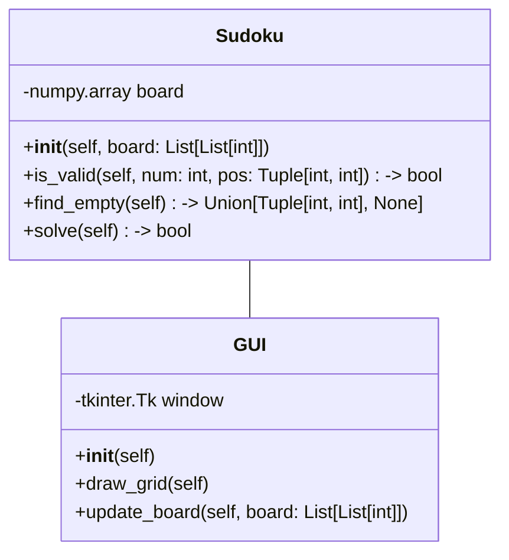
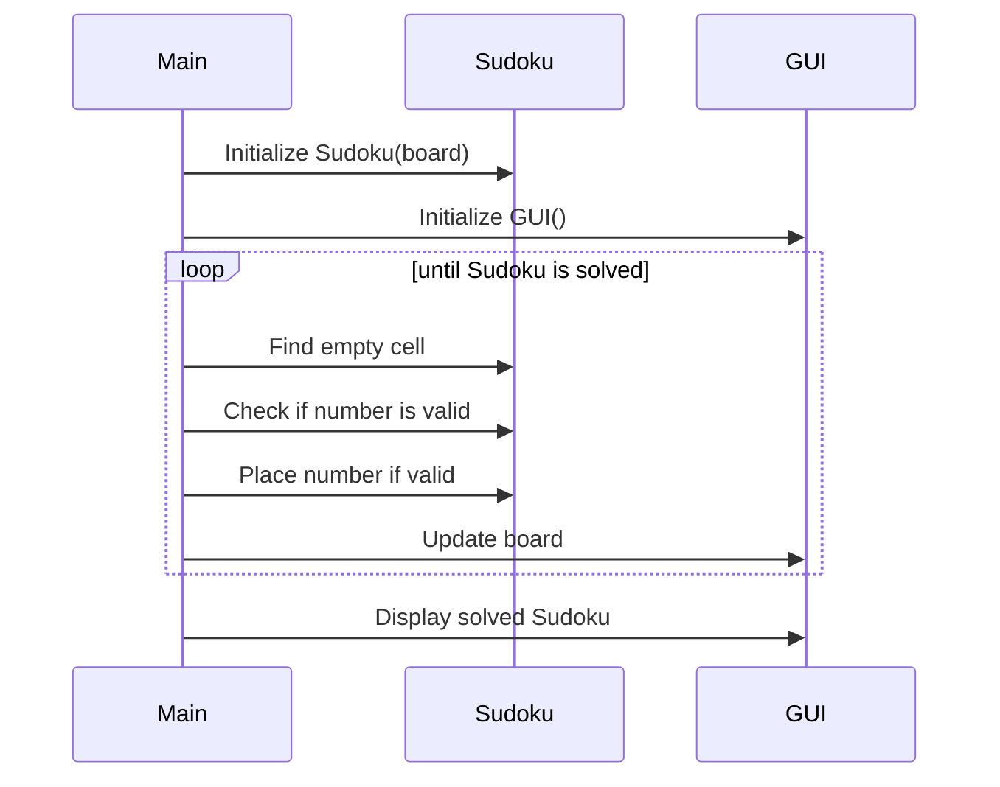

## Implementation approach
We will use Python as our primary language for this project. The Sudoku solver will be implemented using the backtracking algorithm, which is a brute force algorithm that tries all possible numbers for each empty cell until it finds a solution. For the user interface, we will use the Tkinter library, which is a standard Python interface to the Tk GUI toolkit. It provides a powerful object-oriented interface to the Tk GUI toolkit and is simple to use.

We will also use numpy for efficient array operations and matplotlib for visualizing the steps of the solution. We will ensure that the code is PEP8 compliant using tools like pylint and autopep8. We will also use pytest for testing our code.

## Python package name
```python
"sudoku_solver"
```

## File list
```python
[
    "main.py",
    "sudoku.py",
    "gui.py",
    "tests.py"
]
```

## Data structures and interface definitions


## Program call flow


## Anything UNCLEAR
The requirement is clear to me.