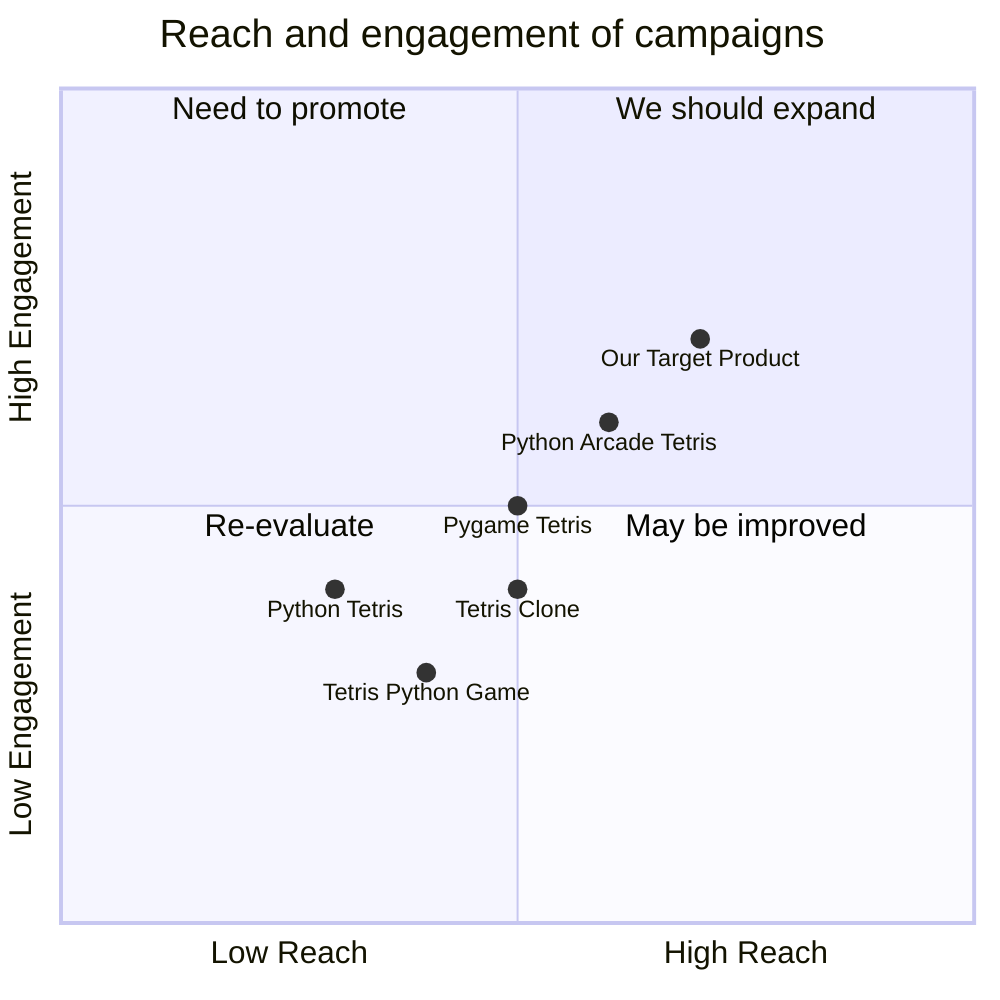

## Original Requirements
Design the software of a Tetris game in Python.

## Product Goals
```python
[
    "Create a simple and engaging Tetris game using Python",
    "Ensure the game is easy to navigate and user-friendly",
    "Ensure the game is efficient and runs smoothly without any lags"
]
```

## User Stories
```python
[
    "As a user, I want to be able to start a new game easily so that I can play whenever I want",
    "As a user, I want to be able to pause and resume the game so that I can take breaks",
    "As a user, I want the game to keep track of my high scores so that I can see my progress",
    "As a user, I want the game to run smoothly without any lags so that I can have a seamless gaming experience",
    "As a user, I want the game to have a simple and intuitive interface so that I can navigate easily"
]
```

## Competitive Analysis
```python
[
    "Python Tetris: A simple Tetris game written in Python. However, it lacks a user-friendly interface and has occasional lags",
    "Pygame Tetris: This game has a more interactive interface but the game controls are not intuitive",
    "Tetris Python Game: This game has a good scoring system but lacks the option to pause and resume the game",
    "Python Arcade Tetris: This game has a good interface and runs smoothly but lacks a high score tracking feature",
    "Tetris Clone: This game is a clone of the original Tetris game. It has a simple interface but lacks features like pausing the game and tracking high scores"
]
```

## Competitive Quadrant Chart


## Requirement Analysis
The product should be a Tetris game developed in Python. The game should have a simple and user-friendly interface. It should include features like starting a new game, pausing and resuming the game, and tracking high scores. The game should run smoothly without any lags.

## Requirement Pool
```python
[
    ("Develop the basic game mechanics of Tetris", "P0"),
    ("Implement a feature to start a new game", "P0"),
    ("Implement a feature to pause and resume the game", "P1"),
    ("Implement a feature to track high scores", "P1"),
    ("Ensure the game runs smoothly without any lags", "P0")
]
```

## UI Design draft
The game interface should be simple and intuitive. It should have a main menu with options to start a new game, view high scores, and exit the game. The game screen should display the current score, the next piece, and the game grid. The game should have simple and clean graphics with a retro feel.

## Anything UNCLEAR
There are no unclear points.