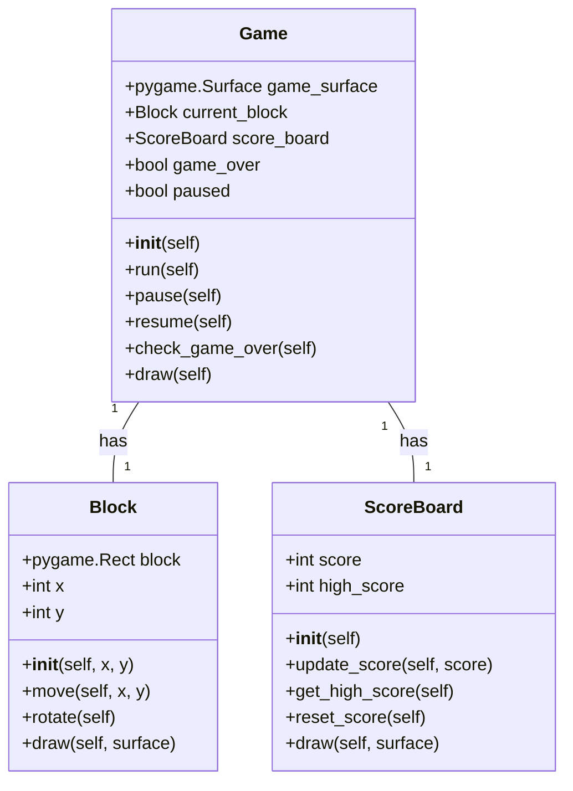
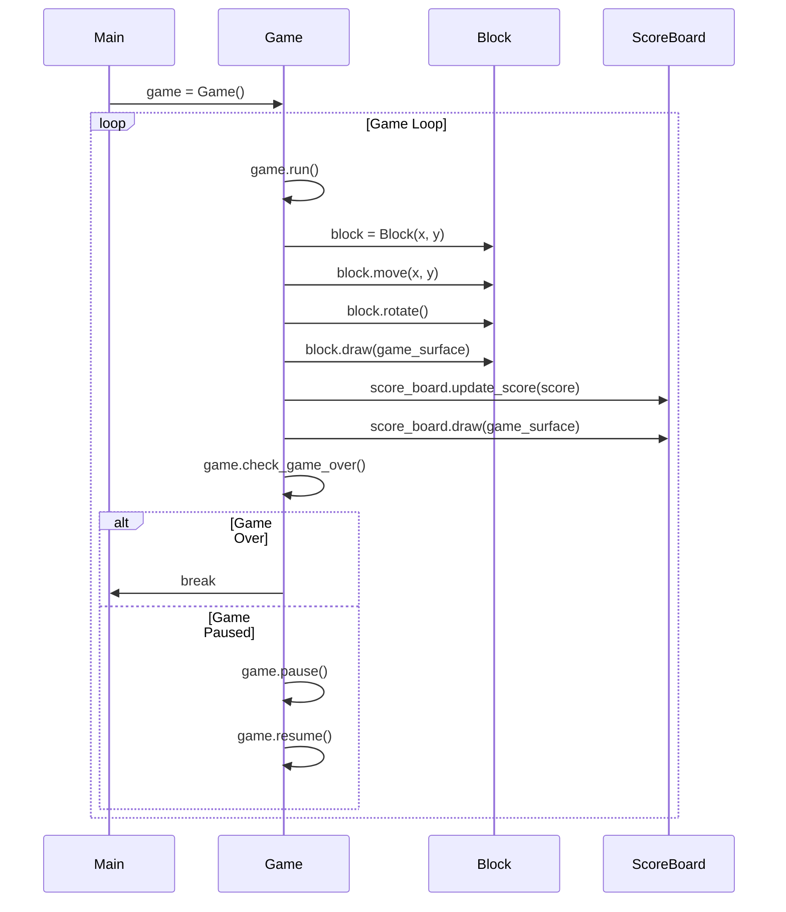

## Implementation approach
We will use the Pygame library, which is an open-source module for Python designed for video game creation. It includes computer graphics and sound libraries. The difficult points of the requirements are the game mechanics of Tetris and the implementation of a feature to track high scores. We will need to design the game in such a way that it efficiently handles the falling blocks and the completed lines. For the high score feature, we will need to implement a way to store and retrieve the highest scores.

## Python package name
```python
"tetris_game"
```

## File list
```python
[
    "main.py",
    "game.py",
    "block.py",
    "scoreboard.py"
]
```

## Data structures and interface definitions


## Program call flow


## Anything UNCLEAR
The requirement is clear to me.